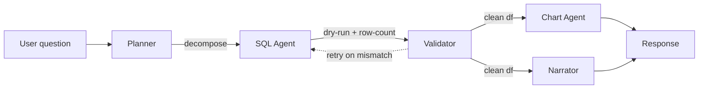

# Airbnb Data Analyst Agent

A drop-in data analyst for any database. Ask a question in English — a multi-agent system plans the work, writes SQL, validates the result, renders a chart, and narrates the answer with citations back to the source rows.

- **Live demo:** https://airbnb-frontend-686529012610.us-east1.run.app/
- **Portfolio:** https://arjun-varma.com/
- **Built at:** Agentic AI for Analytics · Columbia University · 2026

## Problem

Analysts spend hours translating business questions into SQL, pulling data, checking it, and reformatting the answer into something a stakeholder can consume. Most LLM "text-to-SQL" demos hallucinate schema, fail silently on bad queries, or skip the last-mile steps that matter: a chart, a citation, a sanity check.

The goal: a system that behaves like a junior analyst with guardrails — decomposes the question, writes SQL that actually runs, validates the result before showing it, plots the data, and cites the rows it used.

## Challenge

- Text-to-SQL models hallucinate column names, misuse joins, and produce queries that run but return the wrong answer
- Single-prompt LLM approaches have no way to recover from tool errors or mid-query course corrections
- Charts need semantic intent ("show trend over time") not just "make a chart of this dataframe"
- Auditability is table-stakes in any real analytics context — every number shown must trace back to source rows
- Latency and cost must stay bounded even as the agent retries and self-critiques

## Approach — Five Specialized Agents on a Typed Message Bus



1. **Planner** — decomposes the natural-language question into a plan of sub-queries and tool calls
2. **SQL Agent** — writes SQL against the warehouse schema; has access to `db.schema()` and `db.query(sql)` tools
3. **Validator** — runs the SQL as a dry-run first, audits row counts, nulls, and types; self-critiques mismatched intents; retries on tool error (×3, exponential backoff)
4. **Chart Agent** — invokes `plot.auto(df, intent)` to render the right visualization for the question
5. **Narrator** — composes the final answer, citing every number back to specific source rows

All agents communicate via a typed message bus so every step is inspectable and replayable.

## Solution / Architecture

**Tools & contracts**

| Tool | Signature |
|---|---|
| `db.schema()` | `→ Table[]` |
| `db.query(sql)` | `→ DataFrame` |
| `df.describe(df)` | `→ Stats` |
| `plot.auto(df, intent)` | `→ PNG` |
| `web.search(q)` | `→ Link[]` |

**Guards & evals**

- SQL dry-run + row-count sanity check before execution
- Null / type audit before any chart is rendered
- Self-critique when the SQL result doesn't match the planner's stated intent
- Retry on tool error, 3 attempts with exponential backoff
- Golden Q/A regression suite — every commit runs a set of canonical questions and checks the answers

**Warehouse adapters**

Pluggable backends: DuckDB (default for the demo on NYC Airbnb data), Postgres, Snowflake.

## Sample Questions It Answers

- Do superhosts get better review scores than other hosts?
- Which Brooklyn neighborhoods saw the biggest price shift 2019→2023?
- What's the cheapest private room within 1mi of Union Square?
- How does price correlate with review volume for entire homes?

## Impact / Results

- Handles multi-step analytics questions end-to-end with auditable traces
- Every answer is grounded — users can drill into the exact rows the agent cited
- Regression eval suite + per-query latency / cost breakdown keep production behavior measurable
- Designed to plug into any warehouse with a SQL-compatible adapter

## Tech Stack

FastAPI · LangChain · DuckDB / Postgres / Snowflake adapters · OpenAI (function calling) · matplotlib · pytest (evals)

## Run Locally

```bash
git clone https://github.com/ARJUNVARMA2000/airbnb-data-analyst-agent.git
cd airbnb-data-analyst-agent
cp .env.example .env   # add OPENAI_API_KEY
pip install -r requirements.txt
uvicorn app.main:app --reload
```

Frontend in `./frontend` — `npm install && npm run dev`.

## License

MIT
